<p align="center">
  <picture>
    <source media="(prefers-color-scheme: dark)"  srcset="./dark.svg">
    <source media="(prefers-color-scheme: light)" srcset="./light.svg">
    
  </picture>
</p>

<p align="center">
  <a href="https://portofolio-m.vercel.app/"></a>
  <a href="https://www.linkedin.com/in/mahdin-mohammed-6705152a9"></a>
  <a href="mailto:mahdinislamm22@gmail.com"></a>
  
</p>

---

### `>` about

Designing and building whatever comes to mind — from imagination to reality.

Half engineer, half designer. I care a little too much about how a thing feels,
and the part I like best is when a rough idea turns into something someone can
actually click.

```yaml
name:      Mahdinnn
location:  Siegen, Germany
education: IIS Enzo Ferrari Vallauri Hertz — Rome, Italy
building:  websites & apps straight out of my head
learning:  in public — the repos below are the receipts
